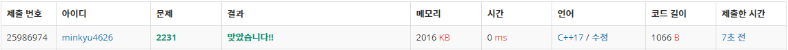

##분해합_2231번
---
- 문제 설명 : <https://www.acmicpc.net/problem/2231>
- 작성일 : 20_02_02
- 출처 : <https://www.acmicpc.net/problem/2231>
- 코드 초안
  ```cpp
  #include <iostream>

  using namespace std;

  int main()
  {
      ios_base::sync_with_stdio(false);
      cin.tie(NULL);

      int N;       // 생성자를 찾을 수
      int ans = 0; // 정답 변수
      cin >> N;

      // N의 생성자를 찾는 핵심 부분
      for (int i = 1; i < N; i++) // 작은 수부터 N까지 검사한다.
      {
          int i_copy = i;
          int sum = i; // i의 분해합

          // i의 분해합을 구하여 sum에 저장되도록 한다.
          while (i_copy != 0)
          {
              sum += i_copy % 10;
              i_copy = i_copy / 10;
          }

          // i가 N의 생성자이면 ans에 저장하고 for문 종료
          if (sum == N)
          {
              ans = i;
              break;
          }
      }

      cout << ans << "\n"; // 구한 값 출력

      return 0;
  }
  ```

- 풀이  
    
  초안으로 작성한 코드도 채점결과 정답으로 인정 되었다.  
  초안의 시간 복잡도는 O(N)으로 선형이다. 문제에서 N은 최대 1,000,000 까지 입력 될 수 있다.  
  최악의 경우에는 for문 안의 연산들이 1,000,000회 수행 된다는 것이다.  
  하지만 이렇게 쓸데없이 많은 연산을 할 필요는 없다. 그 이유를 N = 256인 경우를 예로 들어서 설명 하겠다.  
    
  N이 256이면 이는 세 자리 수이다. 각 자리의 수의 최대값은 9이다.(모두 9가 되는 경우는 있을 수 없지만)   
  따라서 9 * 3 = 27을 뺀 229에서부터 256 사이에만 256의 생성자가 존재할 수 있다.  
      
  위와 같은 이유로 for문의 index의 범위를 굳이 초안처럼 설정하여 시간 복잡도를 O(N)이 되게 할 필요가 없다.  
  그래서 아래와 같이 for문의 index를 범위를 수정하였다.    
  ```cpp
      // N이 몇자리 수인지 구하자
    int N_copy = N;
    int digit = 0; // N은 digit-자리 수이다.
    while (N_copy != 0)
    {
        N_copy = N_copy / 10;
        digit++;
    }

    // N의 생성자를 찾는 핵심 부분
    int begin = (N - 9 * digit) ? N - 9 * digit : 1;
    for (int i = begin; i < N; i++)
  ```
  우선 for문 위의 추가된 while문으로 N이 몇 자리 수인지를 구하여 digit에 저장한다.
  구한 digit을 통해 index가 어디서 시작할지 begin에 저장하는데, begin은 1보다 작은 경우는 고려하지 않아도  
  된다. 따라서 삼항 연산자를 통해 음수인 경우에는 1으로 값이 설정되게 하였다.  
    
  이렇게 코드를 추가, 삽입하고 채점을 해보니  
    
  이렇게 코드 실행 시간이 줄어든 것을 확인할 수 있었다!!
  
  
- 정리
  가벼운 문제였지만 내가 문제를 풀기 위해짠 코드(알고리즘)의 효율성의 중요성을 다시 한번 생각하게 되었다.  
  같은 동작을 하는 알고리즘이라도 사소한 차이 하나가 표본이 많아질 수록 성능차이를 야기할 수 있다는 점을
  고려하며 코딩하는 습관을 들여야겠다.
  
  
